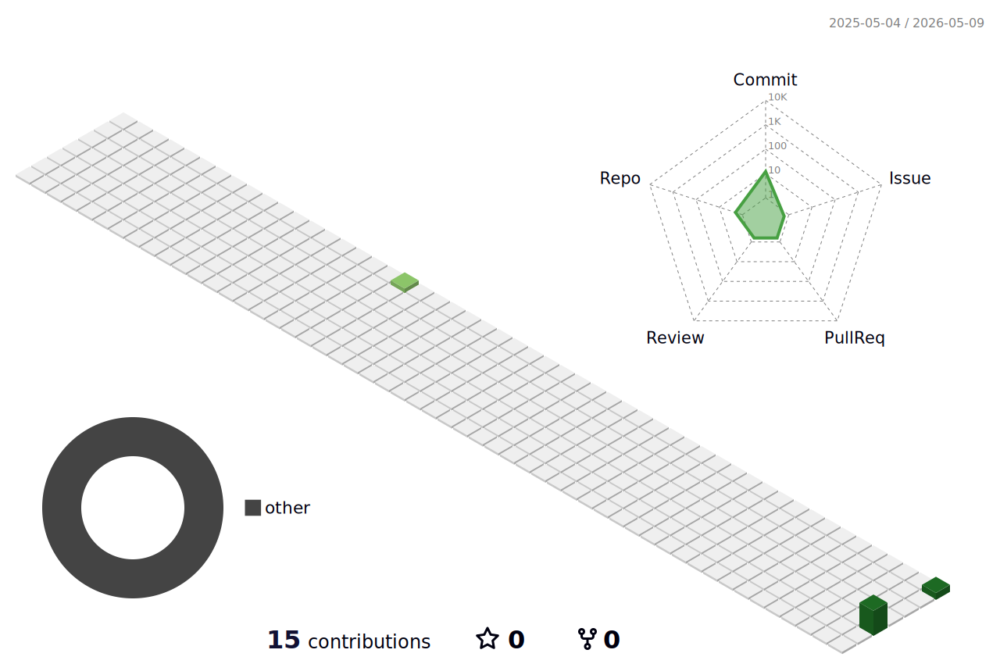

<!-- Header Banner -->

  

<!-- Intro -->
<h1 align="center">Hi, I'm Jun-Hyun</h1>

  I'm currently working on an optical simulation project and an AI development project.

 
<!-- Current Focus -->
<h3 align="center">Current Focus</h3>

<table align="center">
  <tr>
    <td align="center" width="450">
      <b>Optical Simulation</b>
       
       
      Designing and developing simulation-based systems for optical analysis and experimentation.
    </td>
    <td align="center" width="450">
      <b>AI Development</b>
       
       
      Building AI-driven applications with a focus on model development, experimentation, and practical deployment.
    </td>
  </tr>
</table>

 

<!-- Tech Stack -->
<h2 align="center">Tech Stack</h2>

  
   
  

 

<!-- Featured Projects -->
<h3 align="center">Featured Projects</h3>

<table align="center">
  <tr>
    <td align="center" width="450">
      <b>Optical Simulation Project</b>
       
       
      A project focused on building simulation tools for optical systems and analyzing experimental conditions.
       
       
      Python · Simulation · Data Analysis
    </td>
    <td align="center" width="450">
      <b>AI Development Project</b>
       
       
      An AI-based project exploring model development, learning pipelines, and intelligent software systems.
       
       
      Python · PyTorch · TensorFlow 
    </td>
  </tr>
</table>

 

<!-- Honors and Awards -->
<h2 align="center">Honors and Awards</h2>

 

| Year | Competition | Award | Awarding Organization |
|:---:|---|:---:|:---:|
| 2025 | 2025 Gyeonggi-do Future Entrepreneur Discovery Program | 1st Place / Grand Prize | Gyeonggi Provincial Superintendent of Education |
| 2025 | 2025 BizCool Camp IR Final Competition | 1st Place / Grand Prize | Minister of SMEs and Startups |
| 2025 | 18th National Startup & Invention Competition | 1st Place / Grand Prize | Minister of SMEs and Startups |
| 2025 | 18th National Startup & Invention Competition | 1st Place / Grand Prize | Minister of Environment |
| 2025 | 4th Youth Maker Competition | Top Excellence Award | Chairperson of the Seoul Metropolitan Council |
| 2025 | 18th National Startup & Invention Competition | Top Excellence Award | Commissioner of the Korean Intellectual Property Office |
| 2025 | 11th Busan Startup Idea Competition | University President Award | President of Dong-eui University |
| 2025 | Startup Incubating Competition | Creativity Award | President of the Korea Institute of Startup & Entrepreneurship Development |

 

<!-- GitHub Profile 3D Contrib -->
<h2 align="center">GitHub Contribution</h2>

  

